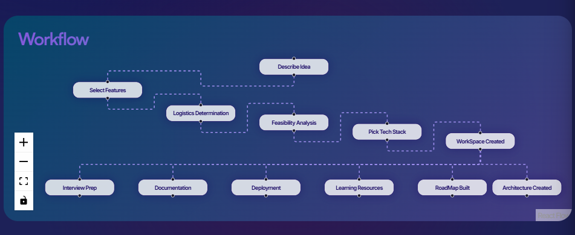
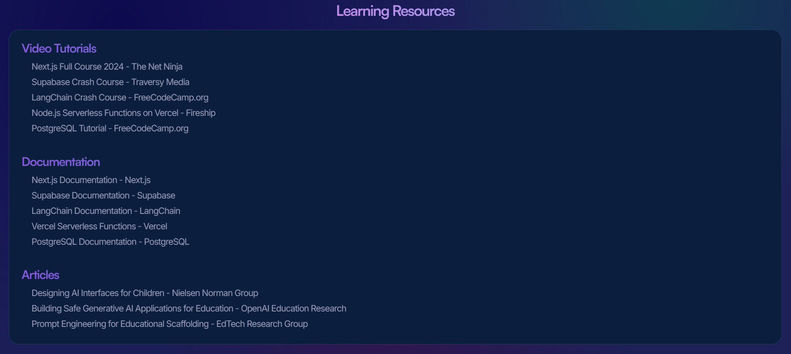
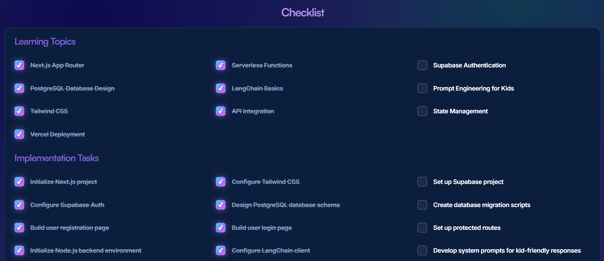
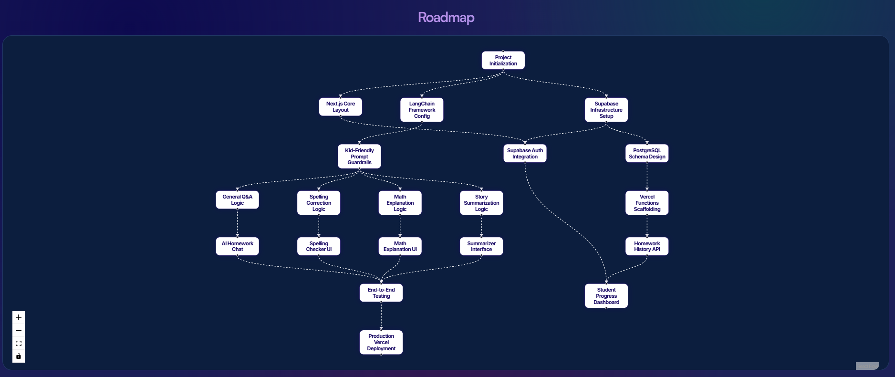
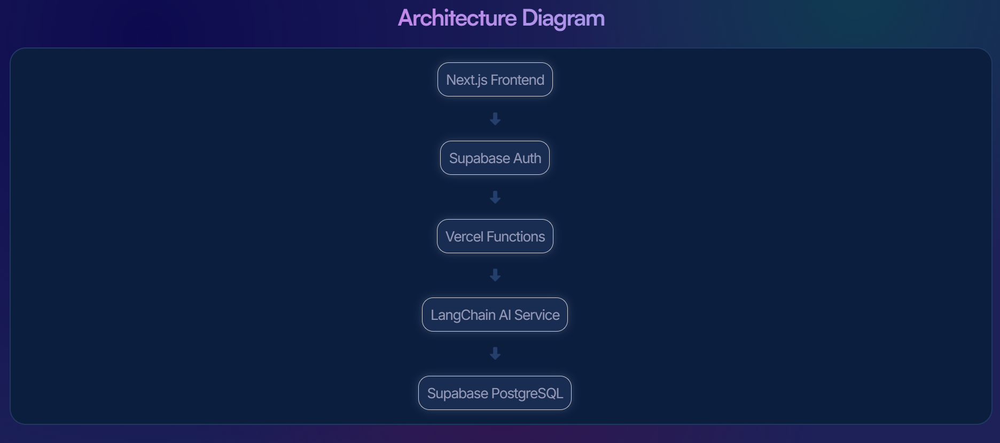
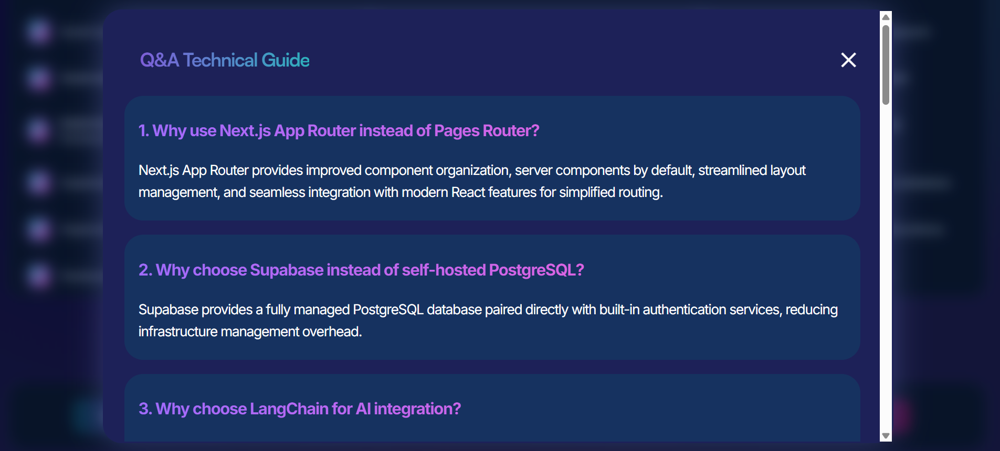
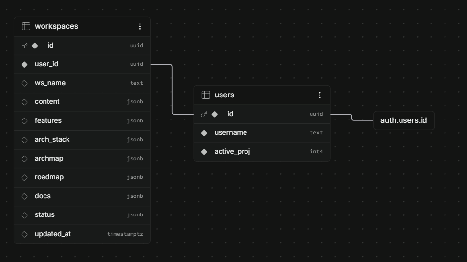

# ✦ Astra AI
### Stop researching. Start building.

**Astra AI** is an AI-assisted project planning and development workspace designed to help developers turn project ideas into structured, understandable implementation plans.

Rather than generating the project for the developer, Astra AI acts as an **AI tutor** and a **Senior mentor**. It helps users understand what they are building, why certain technical decisions make sense, what they need to learn, how the different parts of the system fit together, and how they can approach implementation step by step.

The goal is to make project development more deliberate and educational: the developer remains responsible for building the project, while Astra AI provides the structure and guidance needed to make informed decisions.

**Live Application:** [Astra AI](https://astra-ai-ai.vercel.app/)

---

## Table of Contents
- [Overview](#overview)
- [Core Features](#core-features)
    - [Project Planning](#project-planning)
    - [Feature Planning](#feature-planning)
    - [Technical Feasibility](#technical-feasibility)
    - [Technology Stack Guidance](#technology-stack-guidance)
    - [Learning Guidance](#learning-guidance)
    - [Smart Checklist](#smart-checklist)
    - [Progress Tracking](#progress-tracking)
- [Dependency-Based Roadmap](#dependency-based-roadmap)
- [Architecture Visualization](#architecture-visualization)
- [Documentation Workspace](#documentation-workspace)
- [Authentication](#authentication)
- [Database Structure](#database-structure)
- [Model Allocation](#model-allocation)
- [Technology Summary](#technology-summary)
- [Project Architecture](#project-architecture)
- [Why Astra AI?](#why-astra-ai)
- [Project Goals](#project-goals)


-
---

## Overview

Starting a project can be difficult before any code is written.

A developer may have an idea but still need to determine:

* What the actual scope of the project should be
* Which features are worth implementing
* Which technologies are appropriate
* What concepts need to be learned first
* How the system should be structured
* Whether the proposed project is technically feasible
* What dependencies exist between implementation tasks
* What order the work should be completed in
* How the finished project can be documented and presented

Astra AI brings these planning activities into a single workspace.

The application takes information about a project and uses AI-assisted generation to produce structured development guidance, including project analysis, learning material, feasibility information, architecture, technology choices, implementation checklists, and a dependency-based roadmap.

The resulting workspace becomes a reference that the developer can return to throughout the development process.



### What Astra AI does

Astra AI helps developers:

1. Define and understand their project scope
2. Identify and organize project features
3. Evaluate technical feasibility
4. Select an appropriate technology stack
5. Understand architectural decisions
6. Identify concepts they need to learn
7. Break development into meaningful implementation tasks
8. Visualize implementation dependencies through a roadmap
9. Track their progress
10. Generate supporting project and career documentation

### What Astra AI does not do

Astra AI is intentionally **not an autonomous coding agent**. The goal is not to replace learning or software engineering decisions, but to reduce the research overhead that often prevents developers from starting or completing projects. Instead, the developer uses the generated guidance to understand the project and implement it themselves.

This distinction is central to the project's purpose: the objective is not simply to produce software, but to help the developer understand the software they are producing.

---

# Core Features

## Project Planning

Astra AI takes a project idea and helps transform it into a structured development plan.

The planning process considers the project's scope, features, technical requirements, architecture, feasibility, and implementation requirements rather than treating the original idea as an isolated prompt.

---

## Feature Planning

Projects can be broken down into meaningful features that become part of the broader planning process.

These features are subsequently used as context for other generated sections of the workspace, allowing the generated architecture, roadmap, and learning requirements to remain connected to the project definition.

---

## Technical Feasibility

Astra AI evaluates the proposed project from a technical perspective.

The feasibility analysis helps identify potential challenges and constraints before implementation begins, allowing developers to recognize difficult areas early rather than discovering them after significant development work has already been completed.


## Technology Stack Guidance

Astra AI helps developers reason about the technologies that are appropriate for their project.

Instead of selecting technologies independently from the rest of the planning process, the selected stack becomes part of the context used when generating architecture and implementation guidance.

For each relevant category, the system can provide:

- Recommended architecture
- Alternative architectures
- Recommended stack technology
- Alternative stack technologies
- Reasoning specific to the project

This turns architecture and stack selection into a decision-making process rather than simply asking about the best framework.

This creates a relationship between:

**Project → Features → Technology → Architecture → Implementation**

## Learning Guidance

Astra AI identifies concepts and technologies that the developer may need to understand before or during implementation.

The learning section is designed around the actual requirements of the project rather than providing a generic list of programming topics. This allows the workspace to function as both a project planner and a learning guide.

Resources can include:

- Documentation
- Video Tutorials
- Articles



## Smart Checklist

The workspace separates tasks into:

### Learning Tasks

Concepts and technologies the developer needs to understand.

### Implementation Tasks

Concrete work required to build the project.


The checklist is intentionally separate from the learning material while still contributing to the same overall project progress.

A developer can therefore track both:

* Concepts they need to learn
* Development work they need to complete



## Progress Tracking

Astra AI combines learning and implementation tasks into a unified progress system.

The total project progress is calculated from the number of completed tasks relative to the total number of learning and implementation tasks. This produces a single project completion percentage that can be displayed throughout the application.

---

# Dependency-Based Roadmap

One of Astra AI's main visual components is an automatically generated implementation roadmap.

The roadmap represents development work as a directed graph rather than a simple sequential list. With each node representing a meaningful implementation milestone, while edges represent dependencies between tasks.

For example:


This allows the roadmap to represent projects where:

* Multiple tasks can be completed independently
* A task can depend on multiple prerequisites
* Several branches eventually converge
* Development is not necessarily a simple linear sequence

### Roadmap Generation

The roadmap is generated through a Vercel serverless API endpoint using Gemini. The generation process provides the model with project context including:

* Project idea
* Features
* Scope
* Feasibility
* Architecture
* Checklist information

The model is instructed to generate meaningful implementation milestones rather than extremely small coding actions.

The generated roadmap follows a structured JSON format. The roadmap is then rendered as an interactive graph.


### Roadmap Visualization

The roadmap visualization uses **React Flow** together with **Dagre**. Dagre is responsible for automatically calculating node positions based on their dependencies.

The resulting positions are converted into React Flow node positions. The roadmap automatically fits the generated graph to the available viewport so that larger generated roadmaps remain usable.


---

# Architecture Visualization

Astra AI also generates an architecture representation of the proposed system. The architecture information and selected technology stack are stored together so that the application can retain the structure generated during planning.



---

# Documentation Workspace

Once the project reaches completion, Astra AI can unlock an additional documentation section.

The documentation area provides generated materials such as:

* README
* CV bullet points
* Interview preparation
* Project Q&A

These materials are intended to help the developer communicate the project after completing it. The documentation section is deliberately tied to project completion rather than being immediately available.

This makes the documentation stage part of the overall project workflow rather than an isolated generation feature.




---

# Authentication

Astra AI uses **Supabase Authentication** for account management.

The authentication system supports:

* Account creation
* Email/password login
* Email verification
* Forgot password
* Password reset
* Password visibility toggling

Authentication credentials are managed by Supabase rather than by a custom authentication system. The application does not maintain its own password database.

---

# Database Structure

## `auth.users`

Supabase manages the authentication table. It contains authentication-related information such as the user's identity and credentials. Astra AI does not duplicate password storage in its own database.


## `users`

The application maintains a public user table containing application-specific information:

```text
users
├── id
├── username
└── active_projects
```

### `active_projects`

Tracks the number of currently active workspaces associated with the user. This supports the application's workspace limit without requiring the system to repeatedly count workspace records.


## `workspaces`

The workspace table contains the persistent state of a user's project planning workspace.

The majority of generated project information is stored as **JSONB**.




---

# Model Allocation

Different Gemini models are used for different tasks.

| Task | Model |
|---|---|
| Feature discovery | Gemini 3.5 Flash Lite |
| Feasibility analysis | Gemini 3 Flash |
| Architecture planning | Gemini 3.1 Flash Lite |
| Workspace overview | Gemini 3.5 Flash Lite |
| Checklist | Gemini 3.5 Flash Lite |
| Learning resources | Gemini 3.5 Flash Lite |
| Architecture map | Gemini 3.5 Flash Lite |
| Roadmap | Gemini 3.5 Flash |
| Documentation | Gemini 3.6 Flash |

The intention is to match model capability and generation cost to the complexity of the task rather than using the same model indiscriminately.


---

# Technology Summary

```text
Frontend
├── React
├── Vite
└── Pure CSS

Backend
├── Node.js
└── Vercel Serverless Functions

AI
└── Gemini API

Database & Authentication
└── Supabase

Visualization
├── React Flow
└── Dagre

Deployment
└── Vercel

Version Control
└── Git / GitHub
```
---

# Project Architecture

At a high level, Astra AI consists of four primary layers:

### 1. Frontend 

Responsible for:

* Workspace state
* Authentication UI
* Progress visualization
* Roadmap rendering
* Architecture visualization
* Documentation interfaces

### 2. Supabase

Responsible for:

* Authentication
* Workspace persistence
* Structured JSONB storage

### 3. Vercel Serverless Functions

Responsible for:

* Server-side AI requests
* Protecting sensitive AI credentials
* Acting as the boundary between the frontend and Gemini

### 4. Gemini API Services

Responsible for:

* Project analysis
* Architecture-related generation
* Learning guidance
* Roadmap generation
* Documentation and interview material generation

---

# Why Astra AI?

Astra AI is built around the idea that AI can be useful in development without removing the developer from the learning and decision-making process.

The difficult part is often not writing the first line of code. It is understanding:

* What should actually be built
* Which technologies are appropriate
* What the architecture should look like
* What needs to be learned
* What should be implemented first
* Which parts depend on one another
* Whether the proposed system is realistic

Astra AI attempts to address that planning gap by bringing these decisions into one structured workspace.

The result is intended to be more than an AI-generated project description. It is a development guide that the developer can use while learning and building the project themselves.

---

# Project Goals

The project was designed around several goals:

* Make project planning more structured
* Help developers understand technical decisions
* Connect learning requirements to actual implementation
* Represent implementation dependencies visually
* Provide persistent project workspaces
* Keep AI generation separate from sensitive frontend code
* Make generated information reusable throughout development
* Provide useful documentation once the project is completed
